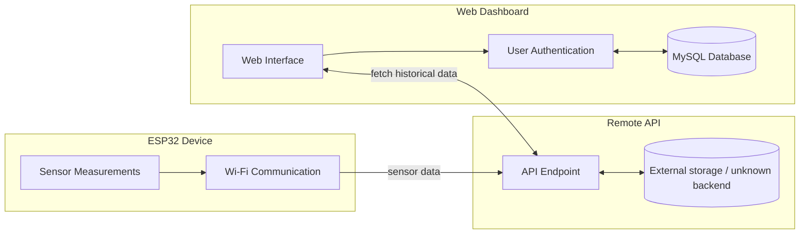

# IoT Sensor Monitoring System

IoT sensor monitoring system that collects sensor measurements from an ESP32 device, transmits data to a remote API via Wi-Fi, and visualizes historical sensor data through a web dashboard with user authentication.

---

## Project Overview

Features:

- ESP32-based sensor monitoring device
- Wi-Fi communication with remote API
- Web dashboard for sensor visualization
- User authentication system
- Session-based login persistence
- MySQL-backed user/session storage for auth and sessions
- Historical sensor data retrieval via an external API endpoint

> Note: the external sensor API endpoint is not maintained in this repository, and its backend storage is unknown.

---

## System Architecture



---

## Software Stack

Firmware:
- C++
- PlatformIO
- ESP32 

Backend:
- Python
- FastAPI

Frontend:
- HTML/CSS/JavaScript
- Chart.js

Database:
- MySQL
- Docker

---

## Backend/Database Details

### Users Table
Stores:
- id
- first_name
- last_name
- username
- password_hash
- created_at

### Sessions Table
Stores:
- session_id
- session_data (e.g., user_name, logged_in_status)
- created_at

> Note: MySQL was used for user and session management, while the external sensor data was handled by an external API.

---


## Setup Instructions


1. Start database 
    ```bash
    docker-compose up -d
    ```

2. Create a virtual environment:
   ```bash
   python -m venv venv
   source venv/bin/activate 
   ```
3. Install dependencies:
   ```bash
   pip install -r requirements.txt
   ```
4. Run backend:
   ```bash
   python server/main.py
   ```

---

## Challenges/Lessons Learned
- Integrating backend, frontend, and database components into a cohesive system
- Implementing secure user authentication with session management
- Interfacing with external API documentation
- Ensuring secure password storage with hashing
- Implementing session-based login persistence
- Deploying MySQL in a Docker container for development
- debugging and testing across multiple components (ESP32 firmware, backend API, frontend dashboard)
- Managing MySQL database for user/session storage
